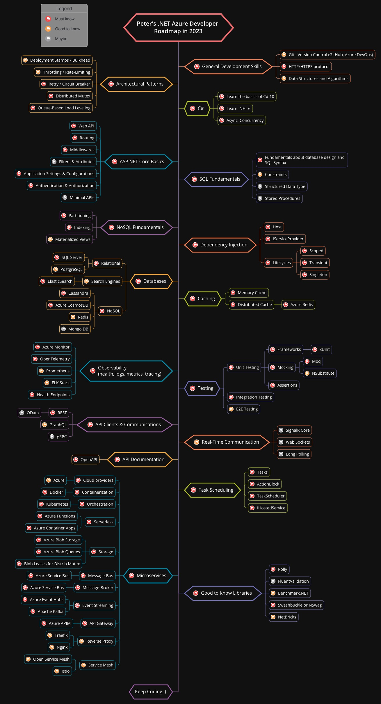

# Peter's .NET Backend Developer Roadmap for 2022

This is my (very opinionated) roadmap for .NET Azure developers that want to focus on backend and specifically work with microservices. If you want a more generic ASP.NET Backend Developer Roadmap, you can check Nick Chapsas' developer roadmap that inspired this one [here](https://github.com/Elfocrash/.NET-Backend-Developer-Roadmap).

